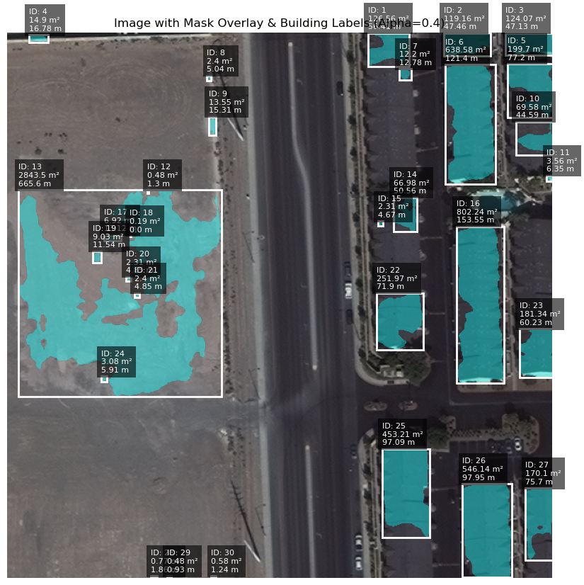
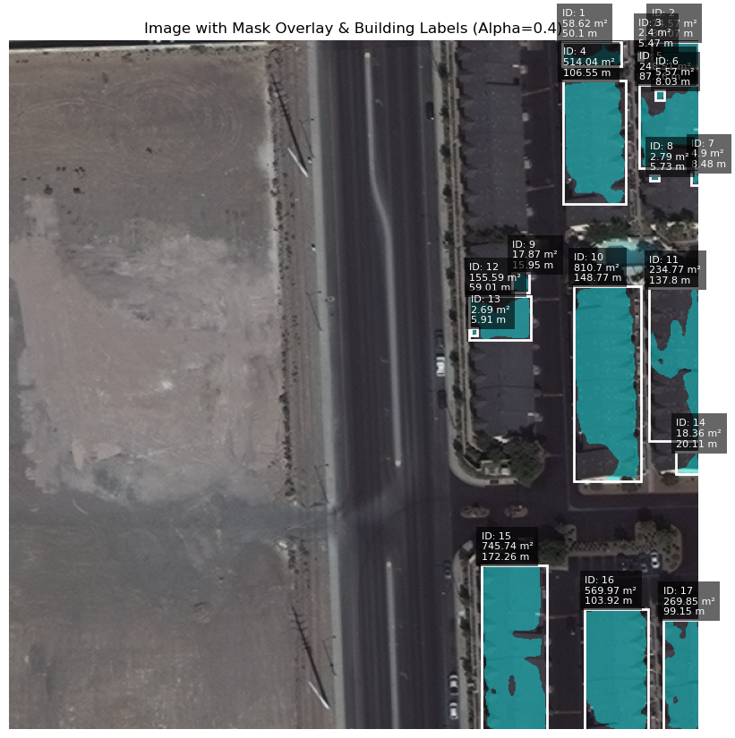

# Geospatial Area & Perimeter Estimation

## Introduction

This project aims to extract building footprints from high-resolution RGB-PanSharpen satellite images and estimate their area and perimeter. The **RGB-PanSharpen data** provides a balance of high resolution and color information, making it ideal for detecting building structures.

The **Ground Sampling Distance (GSD)**, which represents the real-world distance covered by a single pixel, is critical for accurate area and perimeter estimation. Given that each image tile covers **200m x 200m** with a resolution of **640x640 pixels**, we calculate:

```math
\ GSD = \frac{200}{640} \approx 0.31m
```

## Approach

The methodology for building footprint extraction and measurement follows these key steps:

1. **Preprocess TIFF Images**
   - Normalize pixel values (0-255).
   - Resize images to **640x640** while maintaining the original bounding box.
2. **Convert GeoJSON to Raster Masks**
   - Rasterize building footprints using the image's coordinate reference system (CRS).
3. **Train Deep Learning Model**
   - Use **ResNeXt + UNet** for segmentation to extract buildings from images.
4. **Predict & Postprocess Masks**
   - Apply trained model to generate binary masks.
   - Compute **area (m²) and perimeter (m)** for each detected building.
5. **Visualize Results**
   - Overlay predicted masks on images with labels for detected buildings.

## Installation & Dependencies

```bash
pip install git+https://github.com/qubvel/segmentation_models
pip install --upgrade tensorflow keras
pip install git+https://github.com/qubvel/classification_models.git
pip install rasterio geopandas matplotlib numpy scikit-image
```

## Dataset

The dataset used for training and testing is the **SpaceNet Building Footprints dataset**, specifically **AOI_2_Vegas**.

Download the dataset from AWS:

```bash
aws s3 cp s3://spacenet-dataset/spacenet/SN2_buildings/tarballs/AOI_2_Vegas_Test_public.tar.gz dataset/backups/
aws s3 cp s3://spacenet-dataset/spacenet/SN2_buildings/tarballs/SN2_buildings_train_AOI_2_Vegas.tar.gz dataset/backups/
```

Extract the dataset:

```bash
tar -xzf dataset/backups/AOI_2_Vegas_Test_public.tar.gz -C dataset/
tar -xzf dataset/backups/SN2_buildings_train_AOI_2_Vegas.tar.gz -C dataset/
```

## Directory Structure

```
dataset/
  ├── AOI_2_Vegas_Train/
  │   ├── RGB-PanSharpen/  # High-resolution images
  │   ├── geojson/buildings/  # Building footprint labels
  ├── AOI_2_Vegas_Test_public/
  │   ├── RGB-PanSharpen/
  ├── processed_images/  # Preprocessed image outputs
  ├── processed_masks/  # Generated masks
```

## Preprocessing

1. **TIFF Image Preprocessing**

```python
def preprocess_tiff(image_path, out_folder):
    """Resizes image to 640x640 while maintaining geographic bounds."""
```

2. **Rasterizing GeoJSON Masks**

```python
def rasterize_geojson(geojson_path, reference_tif_path, out_mask_path):
    """Converts vector building footprints to raster masks."""
```

## Model Training

We use **ResNeXt-50 + UNet** for segmentation:

```python
model = sm.Unet(backbone_name='resnext50', classes=1, activation='sigmoid', encoder_weights='imagenet', input_shape=(640, 640, 3))
model.compile(optimizer='adam', loss='binary_crossentropy', metrics=['accuracy'])
```

Train the model:

```python
model.fit(X_train, Y_train, epochs=10, batch_size=2, validation_split=0.1)
```

Save the trained model:

```python
model.save("outputs/unet_resnext_building_extraction.h5")
```

## Inference

Load and use the trained model for predictions:

```python
model = tf.keras.models.load_model("outputs/unet_resnext_building_extraction.h5")
preds = model.predict(X_test)
binary_preds = (preds > 0.5).astype('uint8')
```

## Area & Perimeter Estimation

```python
def compute_area_perimeter(mask_2d, pixel_size=0.31):
    labeled = label(mask_2d)
    results = []
    for region in regionprops(labeled):
        area_m2 = round(region.area * (pixel_size ** 2), 2)
        perimeter_m = round(region.perimeter * pixel_size, 2)
        results.append({ 'label': region.label, 'area_m2': area_m2, 'perimeter_m': perimeter_m })
    return results
```

## Visualization

Overlay predicted masks on images with bounding boxes and labels:

```python
def overlay_mask_with_labels(image_path, mask_2d):
    fig, ax = plt.subplots(figsize=(10,10))
    ax.imshow(image)
    ax.imshow(mask, alpha=0.4, cmap='Reds')
    for region in compute_area_perimeter(mask_2d):
        minr, minc, maxr, maxc = region['bbox']
        ax.add_patch(Rectangle((minc, minr), maxc-minc, maxr-minr, edgecolor='white', facecolor='none'))
        ax.text(minc, minr-5, f"{region['label']}\n{region['area_m2']} m²\n{region['perimeter_m']} m", fontsize=8, color='white', bbox=dict(facecolor='black', alpha=0.6))
    plt.show()
```

## Results

For each test image, the output includes:

- **Binary mask of detected buildings**
- **Overlaid visualization with labeled areas and perimeters**

## Notes on various approaches:

- Resnext50 + Unet with 1 training epoch and no data augementation: 
    - Results: accuracy: 0.9273 - loss: 0.1911 - val_accuracy: 0.9337 - val_loss: 0.1640
    - Image: 
        -  The results from the run were okay for some categories like smaller suburban houses, but the model failed to detect larger buildings like apartments and commercial buildings. The model also failed to detect buildings with complex shapes.
- Resnext50 + Unet with 3 training epoch and data augementation: 
    - Results: 
        - accuracy: 0.8818 - loss: 0.2842 - val_accuracy: 0.9179 - val_loss: 0.2312
        - accuracy: 0.9229 - loss: 0.1934 - val_accuracy: 0.9051 - val_loss: 0.2483
        - accuracy: 0.9351 - loss: 0.1665 - val_accuracy: 0.9094 - val_loss: 0.3201
    - Image: 
        - The results from the run better and worse in various ways. There were less false positives as seen in the image above but the model still failed to detect buildings with apartment complexes and commercial buildings. The model also failed to detect buildings with complex shapes.
- EfficientNetB7 + Unet with 3 training epoch and data augementation: 


## References

- Van Etten, A., Lindenbaum, D., & Bacastow, T.M. (2018). *SpaceNet: A Remote Sensing Dataset and Challenge Series*. ArXiv, abs/1807.01232.
- Segmentation Models Library: https://github.com/qubvel/segmentation_models
