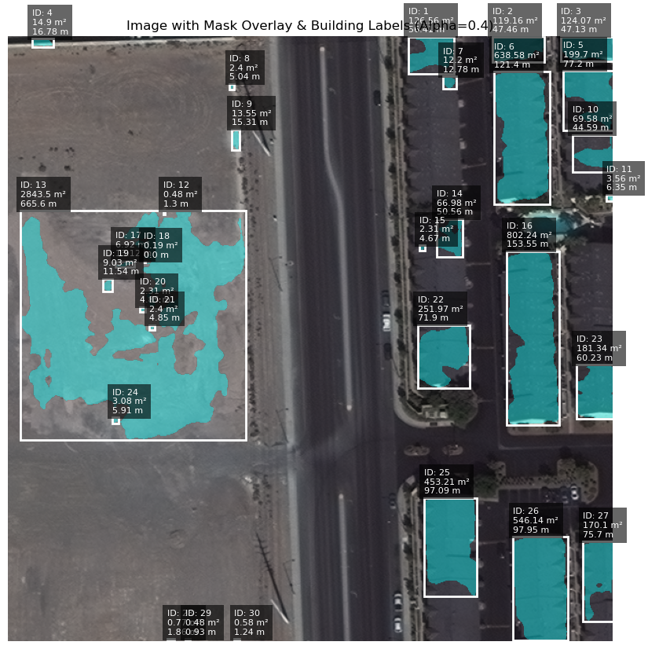
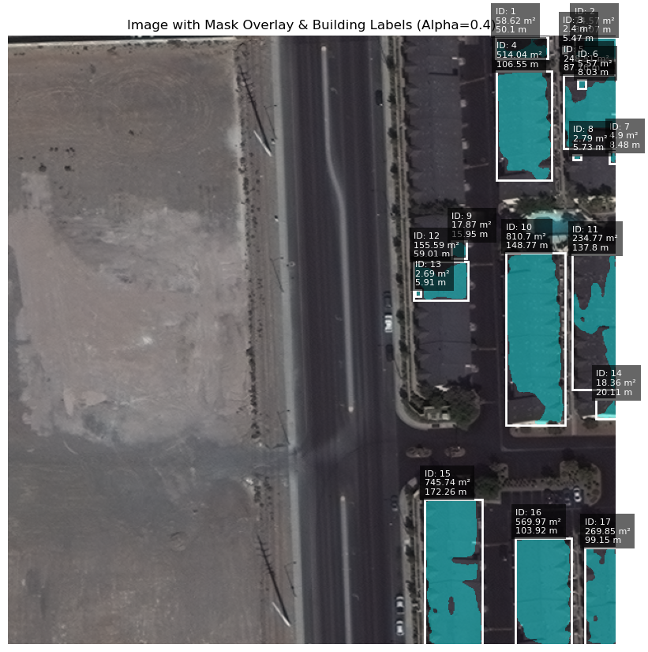
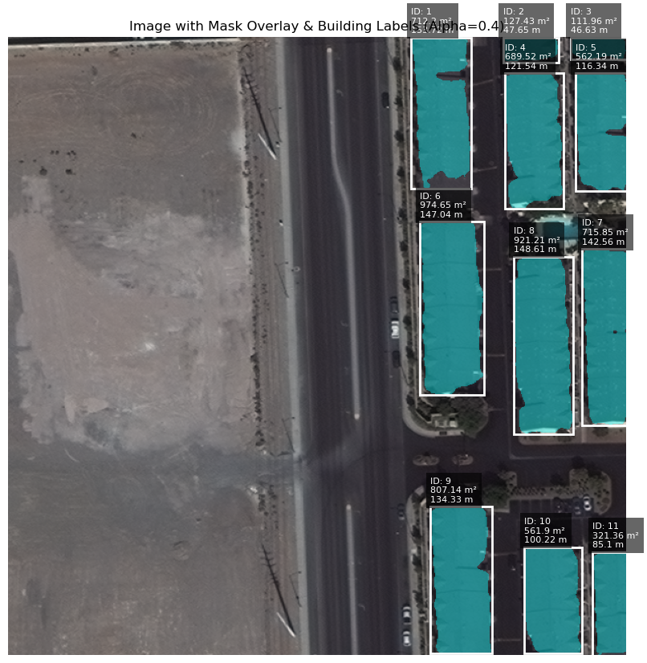
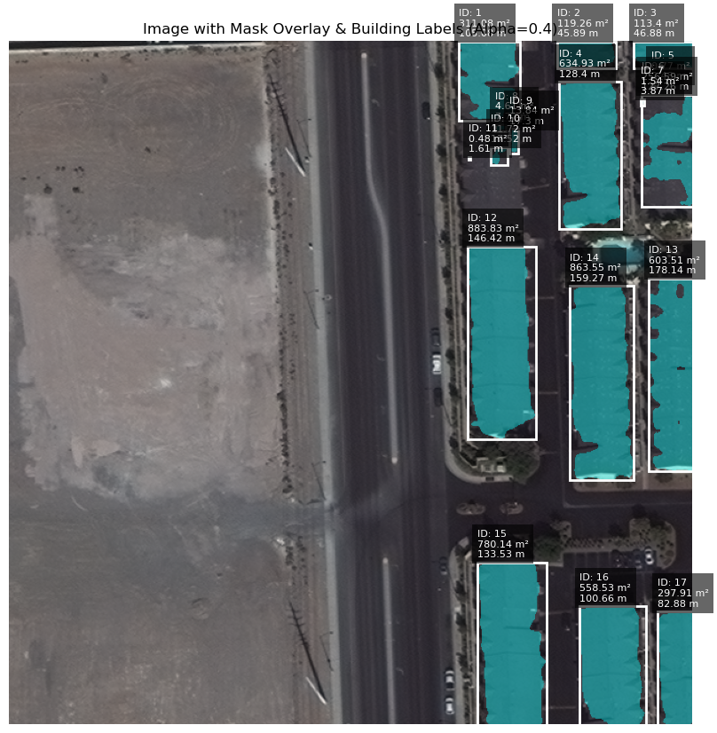

## Results

For each test image, the output includes:

- **Binary mask of detected buildings**
- **Overlaid visualization with labeled areas and perimeters**

## Notes on various approaches:

- **Resnext50 + Unet with 1 training epoch and no data augementation:**
  - **Results:** accuracy: 0.9273 - loss: 0.1911 - val_accuracy: 0.9337 - val_loss: 0.1640

    

    - The results from the run Ire okay for some categories like smaller suburban houses, but the model failed to detect larger buildings like apartments and commercial buildings. The model also failed to detect buildings with complex shapes.
- **Resnext50 + Unet with 3 training epoch and data augementation:**
  - **Results:**

    - accuracy: 0.8818 - loss: 0.2842 - val_accuracy: 0.9179 - val_loss: 0.2312
    - accuracy: 0.9229 - loss: 0.1934 - val_accuracy: 0.9051 - val_loss: 0.2483
    - accuracy: 0.9351 - loss: 0.1665 - val_accuracy: 0.9094 - val_loss: 0.3201

    

    - The results from the run better and worse in various ways. There Ire less false positives as seen in the image above but the model still failed to detect buildings with apartment complexes and commercial buildings. The model also failed to detect buildings with complex shapes.
- **EfficientNetB7 + Unet with 1 training epoch and data augementation:**
  - **Results:**

    - accuracy: 0.8992 - loss: 0.2431 - val_accuracy: 0.9197 - val_loss: 0.2512

    

    - The results from the run Ire better than the previous runs. The model was able to detect more buildings than the previous runs but still failed at the edges of buildings. Its also evident that the model fails on building whose roofs have high contrast where one side of the roof is much brighter that the other side.
- **EfficientNetB7 + Unet with 5 training epoch and data augementation:**
    - **Results:**
        - Epoch 2/5 f1-score: 0.8474 - iou_score: 0.7385 - loss: 0.2375 - val_f1-score: 0.7812 - val_iou_score: 0.6676 - val_loss: 0.3066
        - Epoch 3/5 f1-score: 0.8564 - iou_score: 0.7527 - loss: 0.2212 - val_f1-score: 0.7990 - val_iou_score: 0.6929 - val_loss: 0.2855
        - Epoch 4/5 f1-score: 0.8735 - iou_score: 0.7786 - loss: 0.1943 - val_f1-score: 0.7341 - val_iou_score: 0.6288 - val_loss: 0.3671

  

  - The results from this run Ire better for suburban homes but still failed on apartment buildings and commercial buildings. Its possible that the model doesn't have enough data to learn the features of these buildings. Looking at the images from the training performance it looks like the model startted to overrfit. I might be able to get better performance using the mulitspectural data provided in the dataset.

- **EfficientNetB7 + Unet with 11 training epoch and additional data augementation:**
    - **Results:**
      - Epoch 9/50 f1-score: 0.8881 - iou_score: 0.8003 - loss: 0.1686 - val_f1-score: 0.7989 - val_iou_score: 0.6893 - val_loss: 0.2822
      - Epoch 10/50 f1-score: 0.8862 - iou_score: 0.7971 - loss: 0.1733 - val_f1-score: 0.8144 - val_iou_score: 0.7055 - val_loss: 0.2699
      - Epoch 11/50 f1-score: 0.8966 - iou_score: 0.8136 - loss: 0.1576 - val_f1-score: 0.7911 - val_iou_score: 0.6789 - val_loss: 0.2956

  

